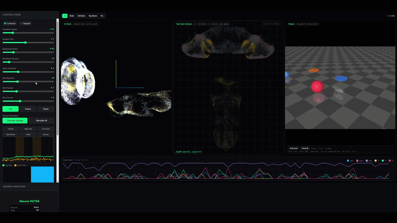

# Fruit-Fly Connectome Digital Twin

Real-time spiking network of the adult male *Drosophila* CNS connectome. Feather files → signed sparse graph → LIF neurons → live 3D / raster visualization. Every flash is a simulated spike.



The brain and neural network were built manually (custom LIF simulation over the connectome graph). FlyGym is used only for the body and environment, because it offers highly detailed body sensors and actuators.

- `server.py` — live FastAPI + WebSocket backend (use this)
- `app.py` — offline pipeline → `fly_brain_results.png` + `fly_brain_spikes.npz`
- `flygym_bridge.py` — optional MuJoCo fly body (closed-loop drive/senses)
- `flybrain/` — modular package (config, connectome, lif, pools, simulation, api, body)
- `static/` — web UI (3D brain, top-down view, raster, rates)

## Data files (in this folder)

From the Male CNS v1.0 dataset (minconf 0.5) — based on the Google and Janelia connectome project: https://male-cns.janelia.org/

- `body-annotations-male-cns-v1.0-minconf-0.5.feather` — ~211k neurons, types, soma locations
- `body-neurotransmitters-male-cns-v1.0.feather` — per-neuron NT predictions → excitatory/inhibitory signs
- `connectome-weights-male-cns-v1.0-minconf-0.5.feather` — ~152M edges (`body_pre, body_post, weight`), filtered to annotated + `MIN_WEIGHT`

## Run it

```powershell
pip install -r requirements.txt
# GPU (optional, auto-used): pip install --upgrade torch --index-url https://download.pytorch.org/whl/cu126

uvicorn server:app --port 8000
```

Open http://localhost:8000 → Run → Stimulate Sensory. First load takes a while (1 GB connectome, watch `sim.log`).

Offline version:

```powershell
python app.py
```

Tuning lives in `flybrain/config.py` (`ServerConfig` / `OfflineConfig`). If CUDA OOMs or steps run slow, raise `MIN_WEIGHT` (5 → 10) and restart.
